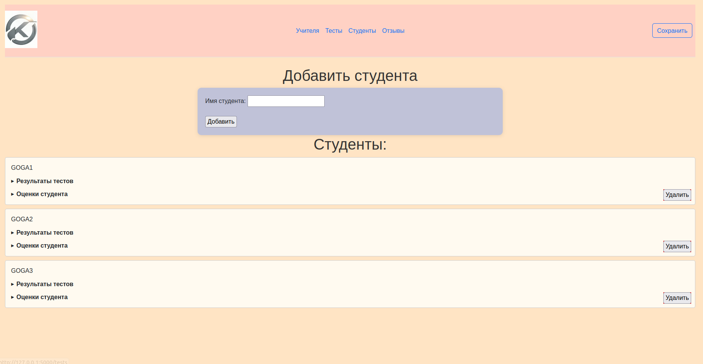

# Отчет

---------------
## Задание

За основу берется результат лабораторной работы №1. Необходимо разработать веб-интерфейс (клиент-серверное приложение) к программной системе, которая получилась в л/р №1. 

### Учитывая следующие требования:

- Необходимо использовать какой-либо фреймворк создания веб-приложений (рекомендуется Flask/Django/FastAPI)
- Пользовательский веб-интерфейс должен включать все возможности управления моделью, а также отображения текущего состояния модели из л/р №1.
- Необходимо сохранить/выделить общий код для л/р №1 и л/р №4, продемонстрировать работоспособность CLI и веб-интерфейса с выделенным общим кодом.
- Задокументировать реализацию при помощи языка разметки markdown
Исходники программы и документация должны быть размещены на github

## Реализация

1. Приложение было разработано на основе фреймворка Flask. Данный фреймворк считается самым простым для освоения, а также, как и многие другие веб-фреймворки, предоставляет широкий спектр возможностей для реализации веб-приложения. Он использует Jinja шаблонизатор для реализации HTML.

2. Реализованы полноценные страницы для 4 групп

    - Учителя;
    - Студенты;
    - Тесты;
    - Отзывы.

3. Несколькими состояними в данной программе обладает класс Тест. Его возможные состояния

    - Ждёт активации;
    - Ждёт пока результаты теста будут оценены;
    - Ждёт выставления оценок студентам.

4. Стоит указать, что из 1 лр ничего переиспользовать не получилось, потому что было ярое желание написать всё с 0 и там просто было нечего переиспользовать из-за слишком плохой реализации. ((**Никто не утверждает, что в данном проекте получилась лучше**))

5. Также написаны небольшие тесты отдельных подмодулей программы, чтобы быстро проверять работоспособность главных функций приложения.

## Фотодокументация

## Вывод

Было разработано веб-приложение с использованием фреймворка Flask. Данное приложение позволяет симулировать систему тестирования знаний. В ней можно добавлять удалять студентов/учителей/тесты/отзывы. Также у сущности 'тест' были реализованы несколько состояний.